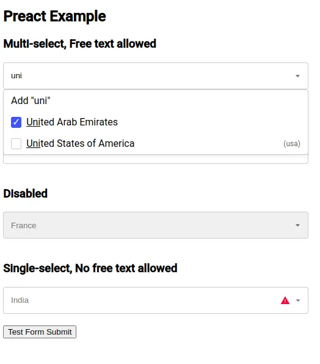

# PreactCombobox

Work-in-progress: DO NOT USE ON PRODUCTION!

A Preact multi-select combobox component



## Installation

```bash
# `npm add preact` first
npm add preact-combobox @popperjs/core
```

## Usage

```jsx
import PreactCombobox, { defaultLabelTransform } from "preact-combobox";

const options = [
  { label: "Option 1", value: "option-1" },
  { label: "Option 2", value: "option-2" },
  { label: "Option 3", value: "option-3" },
];

function App() {
  const [values, setValues] = useState([]);

  return (
    <>
      <h2>Basic example</h2>
      <PreactCombobox
        allowedOptions={options}
        values={values}
        // Make onChange callback is stable. Use `useCallback` if needed. 
        onChange={setValues}
      />

      <h2>Optional stuff</h2>
      <PreactCombobox
        allowedOptions={options}
        values={values}
        onChange={setValues}

        // Optional props (defaults shown)
        className=""
        placeholder=""
        allowFreeText={false}
        disabled={false}
        required={false}
        // any language that Intl.Collator and Intl.Segmenter specifications support for word splitting and matching
        language="en"
        // name attribute. Useful for form submission
        name="my-autocomplete"
        // in case you want to place the dropdown in a different element for z-index management
        portal={document.body}

        labelTransform={defaultLabelTransform}

        // more props for important elements
        rootElementProps={{}}
        inputProps={{}}
        selectElementProps={{}}
      />
    </>
  );
}
```

## Run Demo

```bash
npm run dev
# open http://localhost:3050/example/example.html on a browser
```